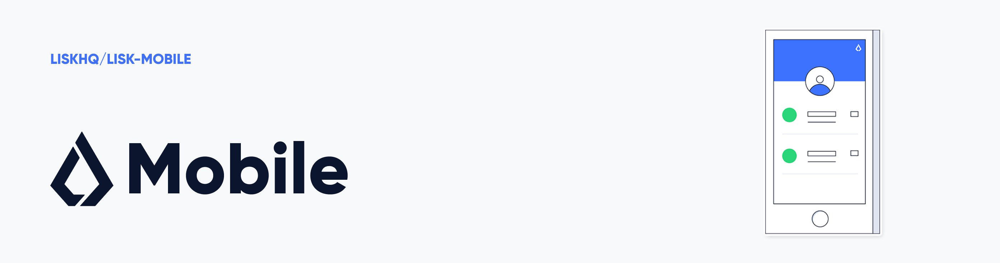

# Lisk Mobile

[](https://jenkins.lisk.com/job/lisk-mobile/job/development)
[](https://coveralls.io/github/LiskHQ/lisk-mobile?branch=development)
[](http://www.gnu.org/licenses/gpl-3.0)

[](https://deepscan.io/dashboard#view=project&tid=6759&pid=8872&bid=113512)

Lisk Mobile is a cross-platform application written in React Native and primarily built for iOS and Android. It provides all the functionalities required that allow the users to send and receive LSK tokens, coupled with the ability to access the activity history of any Lisk blockchain account. 

[](https://itunes.apple.com/us/app/lisk/id1436809559?mt=8) [](https://play.google.com/store/apps/details?id=io.lisk.mobile&pcampaignid=MKT-Other-global-all-co-prtnr-py-PartBadge-Mar2515-1)

## Pre-Installation

Please install the required prerequisites to run Lisk Mobile from source.

- [Brew](https://brew.sh/)

  ```bash
  $ /bin/bash -c "$(curl -fsSL https://raw.githubusercontent.com/Homebrew/install/HEAD/install.sh)"
  ```

- [Git](https://git-scm.com/)

  ```bash
  $ brew install git
  ```

- [Node.js](https://nodejs.org/en/) (recommended 14.9.0)

  ```bash
  $ brew install node
  ```

- [NVM](https://github.com/nvm-sh/nvm)

  ```bash
  $ brew install nvm
  ```

  Remember to follow Brew additional steps for enabling NVM fully. After running `brew install nvm`, Brew will detail this steps.

- [NPM](https://www.npmjs.com/) (recommended 6.14.16)

  ```bash
  $ nvm install-latest-npm
  ```

  `npm` is shipped with Node.js. But to have a specific version installed see [here](https://stackoverflow.com/questions/9755841/how-can-i-change-the-version-of-npm-using-nvm).

- [Watchman](https://facebook.github.io/watchman/docs/install.html)

  ```bash
  $ brew install watchman
  ```

### iOS

- Install the latest version of [Xcode](https://apps.apple.com/ng/app/xcode/id497799835?mt=12) to use the simulator.

### Android

- Install [Android Studio](https://developer.android.com/studio/index.html), and ensure the options listed below are also checked and installed:
  - Android SDK
  - Android SDK Platform
  - Performance (Intel ® HAXM)
  - Android Virtual Device
- Install the Android SDK. Consider these configurations:
  - compileSdkVersion: 33
  - buildToolsVersion: 33.0.0

## Installation

On your terminal, go to the directory you want to install Lisk Mobile and run:

```bash
$ git clone https://github.com/LiskHQ/lisk-mobile.git
$ cd lisk-mobile
$ nvm install
$ npm ci
$ npm run link
```

### Run

```bash
$ npm start
```

### Run on iOS - MacOS with Intel chip

To run the app on ios, you have to install `pods`.

For this, just run:

```bash
$ npx pod-install
$ npm run ios
```

### Run on iOS - MacOS with Apple chip

If your machine has the [Apple Silicon](https://support.apple.com/en-us/HT211814) chip (not Intel), you will have to run some additional steps, which we hope are going to be solved in a short term while the new chip is more widely adopted.

The process is:

1. Locate in Terminal app in Finder.
2. Right-click and click on _Get Info_
3. Check the Open using _Rosetta_ checkbox.
4. Quit Terminal app and run it again
5. Go to your app folder and run `sudo gem install ffi`
6. Run `npx pod-install`
7. Run `npm run ios`

More details can be found [here](https://armen-mkrtchian.medium.com/run-cocoapods-on-apple-silicon-and-macos-big-sur-developer-transition-kit-b62acffc1387).

### Build

Before building the app, make sure to have a valid and non-expired SSL certificate from Lisk Service.

All API calls to Lisk Service pass through a Certificate Pinning process, for which a valid `server-cert.cer` file should be added to the source code before any build. Devnet is excluded from this.

For creating the certificates:

1. Fetch them from Lisk Service server:
    ```bash
    openssl s_client -showcerts -servername <LISK SERVICE NETWORK DOMAIN> -connect <LISK SERVICE NETWORK DOMAIN>:443 </dev/null
    ```
    `LISK SERVICE NETWORK DOMAIN` could be for example, `betanet-service.lisk.com`.
2. The previous command will print on the terminal all the certificates available on that server. Copy the root certificate (from `BEGIN` to `END`), create the file `server-cert.pem` on the root folder of the project and paste the certificate content on it.

3. Convert the certificate from `.pem` to `.cer`:
    ```bash
    openssl x509 -in server-cert.pem -outform der -out server-cert.cer
    ```

The certificate location varies based on the platform which the app is being build. See the "Build on iOS" and "Build on Android" sections for details.

More details of the certificate generation can be found on [the docs of the Certificate Pinning library that we use](https://github.com/MaxToyberman/react-native-ssl-pinning).
#### Build on iOS

Before building on iOS, make sure that Lisk Service's SSL certificate is added to the "_Bundle Resources_" of the app:
1. Open the app on Xcode.
2. Go to _Build Phases_/ _Copy Bundle Resources_/ _Add button_.
3. Add the `server-cert.cer` file.

To build the app on iOS run:

```bash
$ npm run build:ios
```

#### Build on Android
Before building on Android, make sure that Lisk Service's SSL certificate (`server-cert.cer`) is added to the `android/app/src/main/assets` folder.

To build the app on Android run:

```bash
$ npm run build:android
```

### Run on Android

To run android:

```bash
$ npm run android
```

### Unit Tests

#### Single run

```bash
$ npm run test
```

## Development

You can run the project in Xcode and use iOS simulators, or alternatively use Android simulators. There are several options to set up your Android development environment. Please read the [React Native docs](https://facebook.github.io/react-native/docs/getting-started.html) for more information.

There is a standalone app for debugging React Native which has a React and Redux debugger enabled by default. Please read the [React Native Debugger](https://github.com/jhen0409/react-native-debugger) for more information.

### Possible Errors for Mac Users

#### Errors on `lottie-ios/Lottie.modulemap`

If you face this error when trying to run the app:

```
/Users/***/Library/Developer/Xcode/DerivedData/Lisk-***/Build/Products/Debug-iphonesimulator/lottie-ios/Lottie.modulemap
```

Follow these steps below which should resolve any errors:

1. Add the following to the end of your Podfile (especially M1 users).

```ruby
post_install do |installer|
  react_native_post_install(installer)
    installer.pods_project.targets.each do |target|
        target.build_configurations.each do |config|
          config.build_settings["ONLY_ACTIVE_ARCH"] = "NO"
        end
    end
end
```

2. Remove Pods folder and Podfile.lock `rm -rf ios/Pods && rm -rf ios/Podfile.lock`
3. Run `npx pod-install` on your terminal.

#### Duplicate symbols for architecture `x86_64`

If you face this error when trying to run the app:

```
Products/Debug-iphonesimulator/react-native-udp/libreact-native-udp.a(GCDAsyncUdpSocket.o)
ld: 144 duplicate symbols for architecture x86_64
```

Follow this steps to solve it:

1. Run `npx patch-package`
2. Remove Pods folder and Podfile.lock `rm -rf ios/Pods && rm -rf ios/Podfile.lock`
3. `npx pod-install`

#### Other possible errors

##### `SDK location not found. `

Create `android/local.properties` and add this line in the file for Mac Users:

```
sdk.dir=/Users/username/Library/Android/sdk
```

OR

Set the environmental PATH to your sdk installation location.

### Using Commercial Fonts

Since some of the fonts used in the production version are commercial, this repository only contains open source fonts and uses `Open Sans` as a replacement for the commercial ones.

If you have licensed copies of `Basier Circle` and `Gilroy`, you can add them to [fonts folder](./src/assets/fonts) with the naming convention stated in [`styleGuide/fonts.js`](./src/constants/styleGuide/fonts.js) file and make sure all the fonts are linked.

```bash
$ react-native link ./src/assets/fonts
```

## iMessage Extension

Please check out [iMessage extension docs](ios/LiskMessageExtension/README.md) for more information.

## Contributing

Please see [CONTRIBUTING.md](docs/CONTRIBUTING.md) for more information.

## Contributors

See [contributors section](https://github.com/LiskHQ/lisk-mobile/graphs/contributors).

## License

Copyright © 2016-2023 Lisk Foundation

This program is free software: you can redistribute it and/or modify it under the terms of the GNU General Public License as published by the Free Software Foundation, either version 3 of the License, or (at your option) any later version.

This program is distributed in the hope that it will be useful, but WITHOUT ANY WARRANTY; without even the implied warranty of MERCHANTABILITY or FITNESS FOR A PARTICULAR PURPOSE. See the GNU General Public License for more details.

You should have received a copy of the GNU General Public License along with this program. If not, see http://www.gnu.org/licenses/.